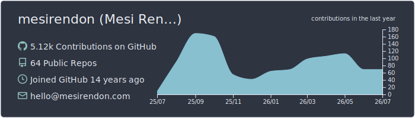
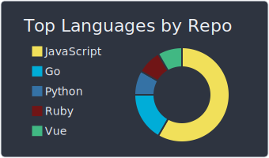
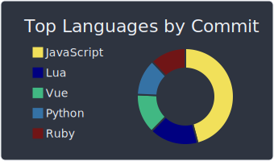
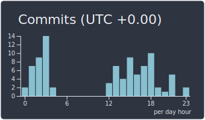

# Hi, I'm Mesi 👋

**Software engineer · writer · musician** — building things at [Modak](https://modak.com), writing at [mesirendon.com](https://mesirendon.com), based in Bogotá 🇨🇴

---

### About me

I write software during the day and write words (and occasionally music) the rest of the time. My [blog](https://mesirendon.com) is where I think out loud — reflections, technical write-ups, and the occasional deep dive into whatever broke my build that week.

- 🔭 Currently building and tinkering with **Neovim tooling**, **Hugo/Tailwind**, and whatever my blog's PostCSS pipeline decides to break next
- 🎵 Arranging and composing on the side — sheet music lives on [MuseScore](https://musescore.com/mesirendon)
- ✍️ Writing long-form reflections and technical notes at [mesirendon.com](https://mesirendon.com)
- 🌱 Into data structures & algorithms, developer tooling, and making small workflows less annoying
- 💬 Ask me about Neovim, Hugo, or why your PostCSS build can't find a native binary

---

### Featured projects

| Project | What it does |
| --- | --- |
| [**nvim-ghrelease**](https://github.com/mesirendon/nvim-ghrelease) | Create GitHub releases without leaving Neovim |
| [**datastructures-and-algorithms-js**](https://github.com/mesirendon/datastructures-and-algorithms-js) | A compilation of the most common data structures & algorithms, implemented in JavaScript |
| [**dotfiles**](https://github.com/mesirendon/dotfiles) | My personal dev environment — Neovim config, shell, and the rest |

---

<!-- BLOG-POST-LIST:START -->
- [nvim-ghrelease](https://mesirendon.com/articles/nvim-ghrelease/)
- [黄金国](https://mesirendon.com/wandering/colombia/sesquile/%E9%BB%84%E9%87%91%E5%9B%BD/)
- [The Repertory](https://mesirendon.com/articles/the-repertory/)
- [Changes to My Site](https://mesirendon.com/articles/changes-to-my-site/)
- [VSCode Workspaces to Tmux Session](https://mesirendon.com/articles/vscode-workspaces-to-tmux-session/)
<!-- BLOG-POST-LIST:END -->

*Thanks for stopping by — go read something at [mesirendon.com](https://mesirendon.com) ✌️*

